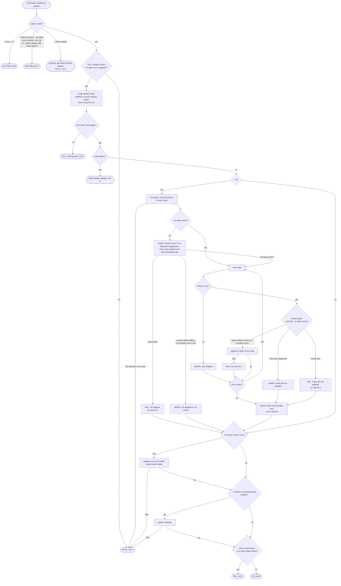

# ns8-cluster-updater

Updates a [NethServer 8](https://nethserver.org) cluster from the leader:
OS packages, core and apps, in that order. Each step is skipped when
nothing is pending.

Made for clusters without a subscription. OS updates cover Rocky Linux
nodes only.

## Before you start

- Run it as root on the cluster leader. On another node it does nothing.
- Without a subscription only. With one, it exits and lets NS8 update.
- Turn off NS8 automatic updates, or both will update the cluster with no
  coordination. NS8's own run also skips the minor release check below:

  ```
  api-cli run set-automatic-updates --data '{"apply_updates_is_active": false}'
  ```
- It only uses tools NS8 core already ships: `runagent`, `jq`, `curl`.
  No SSH between nodes.

## Install

As root on the leader. This downloads the current release, checks the
files and installs the script with its systemd units:

```
cd "$(mktemp -d)"
url=https://github.com/stephdl/ns8-cluster-updater/releases/download/1.0.10
for f in ns8-cluster-updater.sh ns8-cluster-updater.service ns8-cluster-updater.timer SHA256SUMS; do
    curl -fsSLO "$url/$f"
done
sha256sum -c SHA256SUMS
install -m 755 ns8-cluster-updater.sh /usr/local/sbin/
install -m 644 ns8-cluster-updater.service ns8-cluster-updater.timer /etc/systemd/system/
systemctl daemon-reload
systemctl enable --now ns8-cluster-updater.timer
```

The timer runs `--all` once a week, on Monday at a random time between
00:00 and 06:00 (stable per host). A failed run is retried the next Monday,
or start it by hand.
If the host was off, it starts at next boot, but `--os` usually stops
there: the metrics module isn't up yet, so the node OS is unknown. Nothing
is updated and the next timer run does the work.

To update the script, run the same commands again. Each run warns in the
journal when a newer release is out.

After a leader change, install it on the new leader. You can also install
it on every node: only the current leader does the work.

## Usage

```
ns8-cluster-updater.sh [--core] [--modules] [--os] [--os-allow-minor] [--all]
ns8-cluster-updater.sh --check-update
ns8-cluster-updater.sh -h|--help
```

| Option | Effect |
|---|---|
| `--all` | Same as `--os --core --modules`. |
| `--os` | Update OS packages on Rocky Linux nodes. Other nodes are skipped. |
| `--core` | Update NS8 core on all nodes, if a newer version exists. |
| `--modules` | Update all apps, if at least one has an update. |
| `--os-allow-minor` | Allow `--os` to move to a new Rocky minor, e.g. 9.8 to 9.9. |
| `--check-update` | Check if a newer release of this script exists, then exit. |
| `-h`, `--help` | Show help. With no option at all, too. |

Run it now, without waiting for the timer:

```
systemctl start ns8-cluster-updater.service
```

## Changing what runs, and when

Don't edit the shipped units: a reinstall overwrites them. Use drop-ins.

Run other steps:

```
systemctl edit ns8-cluster-updater.service
```

```ini
[Service]
ExecStart=
ExecStart=/usr/local/sbin/ns8-cluster-updater.sh --core --modules
```

Change the schedule, for example back to Tuesday to Friday, the same
days as NS8's own updates:

```
systemctl edit ns8-cluster-updater.timer
```

```ini
[Timer]
OnCalendar=
OnCalendar=Tue..Fri 00:00:00
```

The empty line first (`ExecStart=`, `OnCalendar=`) clears the shipped
value. Without it, systemd keeps both. `systemctl edit` reloads the unit
on save.

Other schedules:

```ini
# Sunday at 3am
OnCalendar=Sun 03:00:00

# Every day at 1am
OnCalendar=*-*-* 01:00:00

# Monday and Thursday at 22:00
OnCalendar=Mon,Thu 22:00:00

# First day of the month, 4am
OnCalendar=*-*-01 04:00:00
```

Shorter random delay: `RandomizedDelaySec=1h` under `[Timer]`.

Check the next run:

```
systemctl list-timers ns8-cluster-updater.timer
```

## Checking a run

```
journalctl -u ns8-cluster-updater.service -e
```

Only warnings and errors:

```
journalctl -u ns8-cluster-updater.service -p warning --no-pager
```

Look there for a skipped OS update, a failed node or a newer script
release. Messages go to stderr with a journal priority prefix: `<3>`
error, `<4>` warning, `<5>` notice, `<6>` info, same as NS8 core's `SD_*`
constants. Under systemd, journald stores that priority, so `-p` filters
on it.

Exit codes:

| Code | Meaning |
|---|---|
| 0 | Done. Some steps may be skipped with a warning. |
| 1 | Something failed, a bad option, or another run already in progress. |

### Newer script release

Each run looks up the latest release on GitHub. When it's newer than the
installed copy, it logs:

```
WARN: newer ns8-cluster-updater release available: 1.0.2 -> 1.0.3, see https://github.com/stephdl/ns8-cluster-updater#install
```

The run goes on. If GitHub can't be reached, it logs an info line and
goes on too. The script never updates itself.

`--check-update` does only that lookup. It exits 0 when up to date, 1
when GitHub can't be reached and 2 when a newer release exists. A `dev`
copy, run from git, never exits 2.

## What you still do by hand

### New Rocky minor releases

The script never moves the cluster to a new Rocky minor on its own. When
one is out, the OS step is skipped on all nodes with a warning. Core and
apps still run. See [OS updates](#os-updates) for how it's detected.

When you're ready for the new minor, run once by hand:

```
ns8-cluster-updater.sh --os --os-allow-minor
```

Don't wait too long. Rocky has no long-term support per minor: once 9.9 is
out, 9.8 gets no more security fixes.

### Reboots

The script never reboots. It checks the leader only, with
`dnf needs-restarting -r`, or by comparing `uname -r` with the newest
`kernel-core` when that dnf plugin is missing. `update-os` doesn't
report it for other nodes. If the leader needs a reboot, the other updated
nodes most likely do too. Check each with `dnf needs-restarting -r`.

### Other OS updates

The script only runs what NS8 supports. For anything else, set it up on
each node. Schedule it on a day this timer doesn't run (it runs on
Monday), so it never overlaps a core update.

- Rocky Linux with EPEL or other repos: a timer of your own running
  `dnf update -y --disablerepo='ns-*'`. Don't use `dnf-automatic`: it
  updates every enabled repo, `ns-baseos` and `ns-appstream` included, and
  skips the minor release check. Add `excludepkgs=podman*` to those repos,
  so NS8 keeps its tested podman.
- AlmaLinux or RHEL: `dnf-automatic` with the distribution repos.
- Debian: `unattended-upgrades`, or
  [proxmox-updater](https://github.com/stephdl/proxmox-updater) for a full
  upgrade.

Reboot the node yourself after a new kernel.

## How a run works

All node work goes through NS8 agent tasks from the leader, in the same
order as NS8's own updates: OS, core, apps. The full logic is in the
[run flowchart](#run-flowchart).

A skipped or failed OS update never stops core and apps. Two OS checks
do stop the whole run before any update: `list-nodes` failing, and a node
whose OS is unknown. A failed core or apps update stops the run at once.

### Why check before updating

`update-core` restarts `redis.service` and `api-server.service` on every
node, even when there is nothing to install. That drops the UI websocket
and running `api-cli` tasks for a few seconds. So the script checks first,
with the same repository view as the update actions, and skips the call
when nothing is pending. A failed check is an error, never "nothing
pending".

Tasks are sent with `extra.isNotificationHidden`, so they don't pop up in
every admin's UI. Failures still show. `api-cli` can't set that flag, so
the script calls the `agent.tasks` Python API directly.

### OS updates

`--os` runs NS8's `update-os` action on each Rocky node, one at a time. It
runs `dnf update` with `ns-baseos` and `ns-appstream` only, like NS8's own
updates.

Each node's dnf output shows when that node is done. A long update can
look silent for minutes. To follow it live, on that node:

```
journalctl -f -u agent@node
```

The node OS comes from `cluster/list-nodes`, fed by the metrics module.
If it's missing for a node, the script stops before any update. Check
the metrics module then.

A node being migrated from NS7 is not updated. The log says so, then the
run goes on.

A failed node does not stop the other steps. The run exits 1 at the end.

Before the OS step, the leader looks up the newest Rocky minor in
`ns-baseos` and `ns-appstream`. It takes the highest of the
`rocky-release` version and of the `el9_N` tags of all packages, so a
mirror shipping 9.9 packages before its `rocky-release` is caught too. It
compares that with each Rocky node's release, from `cluster/list-nodes`.
One lookup covers all nodes: they use the same NethServer mirror.

- Same release everywhere: the OS step runs.
- A new minor is out: the OS step is skipped on all nodes, with a
  warning. Core and apps still run. Exit 0.
- The lookup fails: the OS step is skipped, exit 1.
- The leader has no dnf, so no lookup: the OS step is skipped on all
  nodes, with a warning. Exit 0. Use `--os-allow-minor` to update anyway.

The lookup runs again before each node. If a new minor shows up during the
run, the nodes left are not updated, so the cluster doesn't end up split
across two minors. A minor published while dnf runs on a node can still
reach that node, see [Known limitations](#known-limitations).

### Subscription

With a subscription, the script logs a notice and exits 0. NS8 updates
subscribed clusters itself. Running both would race on the same actions
and on the dnf lock.

### One run at a time

A lock on `/run/ns8-cluster-updater.lock` stops a second run with exit 1,
for example a manual run while the timer runs.

### Script version

The installed version is stamped into the script by the release workflow
(`VERSION=` line) and shows at the start of each run. The release lookup
follows the `/releases/latest` redirect, not the GitHub API, so there's no
rate limit.

## Known limitations

- OS updates: Rocky Linux nodes only, from `ns-baseos` and `ns-appstream`
  only.
- The minor release check only guards this script. NS8 automatic updates
  (`set-automatic-updates --data '{"apply_updates_is_active": true}'`),
  `dnf-automatic` and a manual `dnf update` skip it.
- The release is checked before each node update, not during it. A minor
  published while dnf runs on a node can still reach that node.
- `SHA256SUMS` catches a broken download. It comes from the same release,
  so it doesn't catch a tampered release.

## Run flowchart


